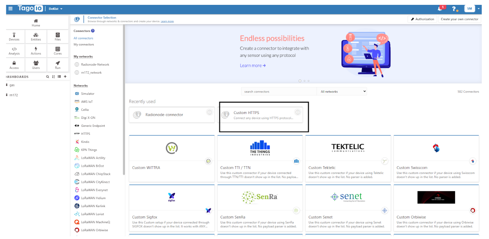
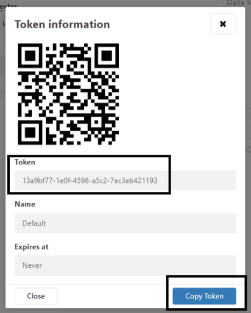
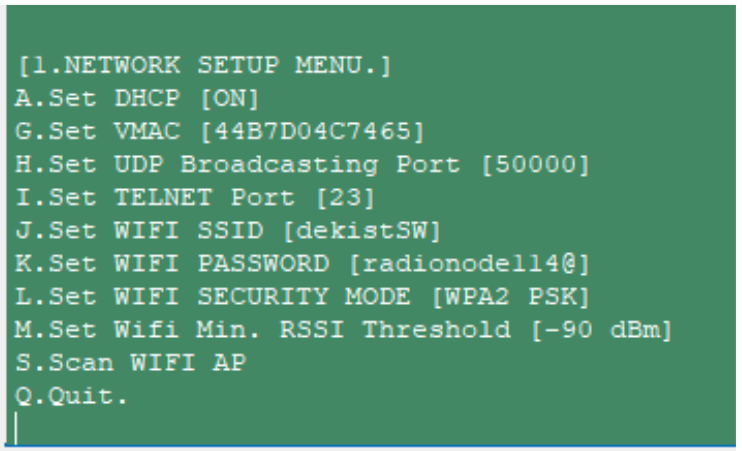
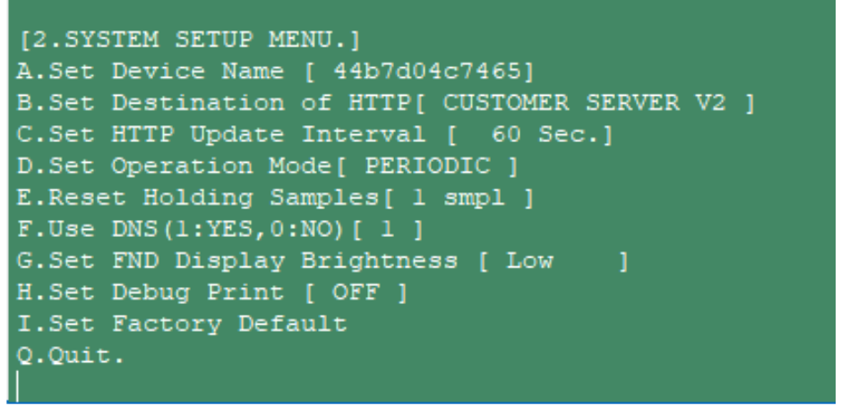
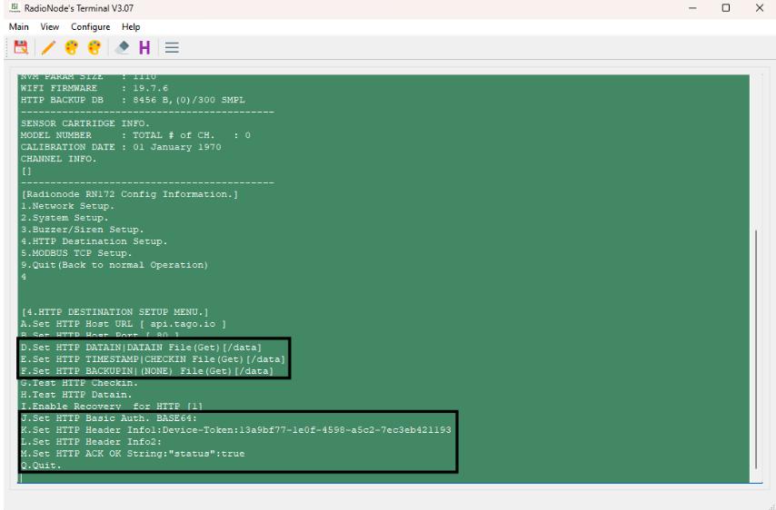
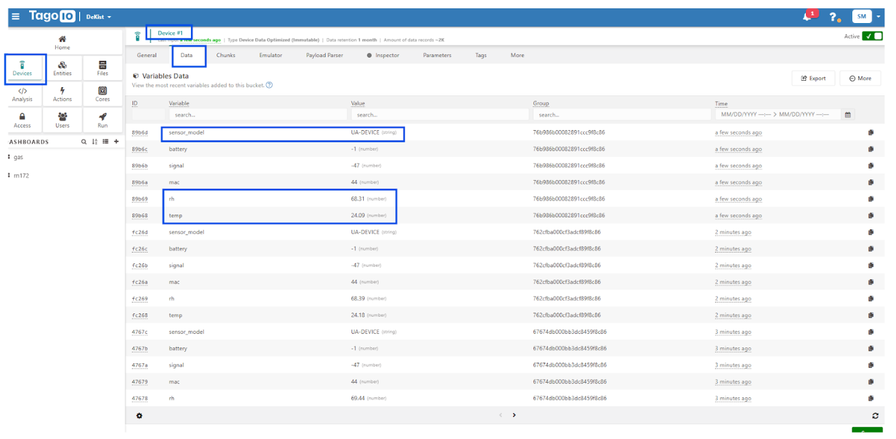
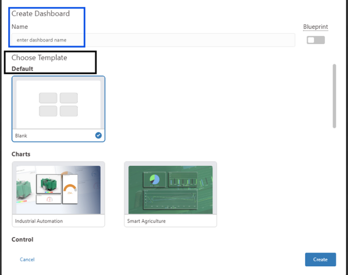

# RN172Plus Series Integration Guide with Tago.io (HTTP)

## Introduction

The **RN172WCD** by RADIONODE® is a versatile Wi-Fi sensor data transmitter designed for real-time environmental monitoring in industrial, commercial, and laboratory settings.

It supports a wide range of UA series sensors, including gas detectors ($CO_{2}$, $O_{2}$, $NH_{3}$, etc.), thermal sensors (PT100, thermocouples), and analog transmitters (4–20 mA, 0–1 V), enabling flexible deployment across various applications. With Wi-Fi (IEEE 802.11 b/g), MODBUS TCP, and HTTP/HTTPS connectivity, the device seamlessly transmits data to cloud platforms like Radionode365, local servers, or PLCs for centralized monitoring. Additional features include a built-in buzzer, dual-color LED indicators, and a 4-digit display for real-time readings and alerts. The RN172WCD also supports remote configuration via Telnet and offers robust alarm functionalities, including SMS and voice call notifications, making it an ideal solution for safety-critical environments such as gas monitoring, HVAC systems, and industrial automation.

---

## Prerequisites

To continue with this guide you will need the following:

* RN-172WCD product
* UA sensor (Choice from 36 options)
* Tago.io account

---

## Create device on Tago

After creating an account in the **tago.io** platform, the next step is to create a device.

1.  Navigate to the **Devices** tab.
2.  Click the **Add Device** button.


3.  Select **`Custom`** device type.
    
  

4.  Give a name to the device and set the **`Custom HTTP`** connector.
    

5.  After the device is created, copy the **Device-Token** from the device information tab to be used in the RN172 terminal program.

---

## Install required Payload parsers

1.  From the device information tab, select the **Payload Parser** tab.
    

2.  Copy and paste the Tago.io JavaScript parser code (provided below) into the editor.
    

```javascript
/**
 * TagoIO Payload Parser for Radionode RN172 Series
 *
 * This parser is designed to handle URL-encoded and ATCQ formatted payloads 
 * received from Radionode RN172WCD devices.
 */

// Helper function to decode URL-encoded string to a data object
function parseUrlEncoded(payload) {
    var data = {};
    // Ensure payload is a string
    var bodyStr = String(payload).trim(); 
    
    if (bodyStr.indexOf('=') !== -1) {
        var pairs = bodyStr.split("&");
        for (var i = 0; i < pairs.length; i++) {
            var parts = pairs[i].split("=");
            if (parts.length === 2) {
                var key = decodeURIComponent(parts[0].trim());
                var value = decodeURIComponent((parts[1] || "").trim());
                data[key] = value;
            }
        }
    }
    return data;
}

// Model lookup table to map channel data to variable names
const ua_models = {
    "UA58-KFG": ["CO", "O2", "H2S", "CO2"],
    "UA58-CO2": ["CO2", "TEMP", "RH"],
    "UA58-DFG": ["CO", "CH2O", "C6H6"],
    "UA58-LEL": ["LEL", "TEMP", "RH", "CLAS"],
    "UA58-APC": ["CO2", "O3", "TEMP", "RH"],
    "UA50": ["TVOC", "ECO2"],
    "UA10": ["TEMP", "RH"],
    "UA-DEVICE": ["TEMP", "RH"],
    "RN172WC": []
    // Add other relevant models as needed
};

// Main function required by TagoIO
function parsePayload(payload) {
    var data = [];
    var deviceData = null;
    var detectedModel = null;
    
    // Attempt to parse as URL-encoded
    deviceData = parseUrlEncoded(payload);
    
    // Check for ATCQ format which is sometimes used by RN172 series
    var inputString = String(payload).trim();
    var atcqMatch = inputString.match(/ATCQ\s+([^,]+),([^,]+),([^,]+),([^,]+)/);
    
    if (atcqMatch) {
        // ATCQ payload format override
        detectedModel = 'UA58-APC';
        deviceData = {
            co2: parseFloat(atcqMatch[1]),
            o3: parseFloat(atcqMatch[2]),
            temperature: parseFloat(atcqMatch[3]),
            humidity: parseFloat(atcqMatch[4])
        };
    }

    if (!deviceData || Object.keys(deviceData).length === 0) {
        return null;
    }

    // --- Step 1: Model Identification ---
    var originalSModel = deviceData.model || deviceData.SMODEL;
    detectedModel = detectedModel || originalSModel;

    // Override the model if the payload structure matches UA58-APC for UA-DEVICE
    if (detectedModel === 'UA-DEVICE' && deviceData.C000) {
        var channelData = String(deviceData.C000).split('|').filter(x => x.trim() !== '');
        if (channelData.length === 5) { // Timestamp + 4 values (CO2, O3, TEMP, RH)
            detectedModel = 'UA58-APC';
        }
    }

    var modelVars = ua_models[detectedModel];
    var timestamp = null;
    var deviceMac = deviceData.mac;

    // --- Step 2: Process Telemetry and Attributes ---

    // Process dynamic channels based on the detected model
    if (detectedModel && modelVars) {
        for (var key in deviceData) {
            if (key.match(/^(C|P|CH)\d+/)) {
                var channelData = String(deviceData[key]).split('|').filter(x => x.trim() !== '');
                if (channelData.length > 1) {
                    // First element is timestamp (in seconds)
                    timestamp = new Date(parseInt(channelData[0]) * 1000).toISOString();
                    
                    for (var i = 0; i < modelVars.length; i++) {
                        var varName = modelVars[i];
                        if (varName && varName !== '----') {
                            var value = parseFloat(channelData[i + 1]);
                            if (!isNaN(value)) {
                                data.push({
                                    variable: varName.toLowerCase(),
                                    value: value,
                                    time: timestamp,
                                    unit: getUnit(varName.toLowerCase()), // Helper function for unit
                                    serie: deviceMac // Group data by device
                                });
                            }
                        }
                    }
                }
            }
        }
    }

    // Process static keys and attributes
    
    // Add static telemetry (e.g., from ATCQ or simple payloads)
    if (deviceData.co2 !== undefined) data.push({ variable: 'co2', value: parseFloat(deviceData.co2), time: timestamp, unit: 'ppm', serie: deviceMac });
    if (deviceData.o3 !== undefined) data.push({ variable: 'o3', value: parseFloat(deviceData.o3), time: timestamp, unit: 'ppb', serie: deviceMac });
    if (deviceData.temperature !== undefined) data.push({ variable: 'temperature', value: parseFloat(deviceData.temperature), time: timestamp, unit: '°C', serie: deviceMac });
    if (deviceData.humidity !== undefined) data.push({ variable: 'humidity', value: parseFloat(deviceData.humidity), time: timestamp, unit: '%', serie: deviceMac });
    if (deviceData.sig !== undefined) data.push({ variable: 'signal', value: parseFloat(deviceData.sig), time: timestamp, unit: 'dBm', serie: deviceMac });
    if (deviceData.bat !== undefined) data.push({ variable: 'battery', value: parseFloat(deviceData.bat), time: timestamp, unit: '%', serie: deviceMac });

    // Process RN172WC 'tags' payload separately
    if (detectedModel === "RN172WC" && deviceData.tags) {
        var tagValues = String(deviceData.tags).split('|').filter(s => s.trim() !== '');
        if (tagValues.length >= 2) {
            data.push({ variable: 'temperature', value: parseFloat(tagValues[0].trim()), time: timestamp, unit: '°C', serie: deviceMac });
            data.push({ variable: 'humidity', value: parseFloat(tagValues[1].trim()), time: timestamp, unit: '%', serie: deviceMac });
        }
    }
    
    // Add device attributes (optional)
    if (deviceData.ver) data.push({ variable: 'firmware', value: deviceData.ver, metadata: { label: "Firmware Version" }});
    if (deviceData.ip) data.push({ variable: 'ip_address', value: deviceData.ip, metadata: { label: "IP Address" }});

    return data;
}

// Simple unit helper (for Tago.io format, units are crucial)
function getUnit(variable) {
    if (variable === 'temp' || variable === 'temperature') return '°C';
    if (variable === 'rh' || variable === 'humidity') return '%';
    if (variable === 'co2') return 'ppm';
    if (variable === 'o3') return 'ppb';
    if (variable === 'h2s') return 'ppm';
    if (variable === 'co') return 'ppm';
    if (variable === 'mA') return 'mA';
    if (variable === 'mV') return 'mV';
    return '';
}

// Tago.io requires the final payload result
// The final result should be an array of TagoIO data objects.
return parsePayload(payload);
```
## Connect device to Tago.io

1.  Download the **RadioNode terminal program**.
2.  Run the RadioNode terminal program and enter the password **`radionode114`** to open the console menu.
     
3.  In the **Network Setup** menu, add the Wi-Fi **SSID** and **password**.
     
4.  Go to the **“2. System Setup”** menu and select **“B. Set Destination of HTTP.”**
5.  Select **“2:CUSTOMER\_V2”** from the three destinations. This means the data will be sent to the custom server V2.

Go to the **“4. HTTP Destination Setup”** menu and configure the following:

* Select **“A. Set Host URL:”** `api.tago.io`
* Select **“D.Set HTTP DATAIN :”** `/data`
* Select **“E.Set HTTP TIMESTAMP:”** `/data`
* Select **“F.Set HTTP BACKUPIN :”** `/data`
* Select **“K. Set HeaderInfo1:Device-Token:”** (Copy and paste **token** from the tago website)
* Select **“M. Set HTTP ACK OK String:”** `"status":true`

 
 

---

## Check data on Tago.io

To access data, just go to the **Devices** page and click on the device name and the **Data** button. We can access the real-time data.

 

---

## Setting up the Dashboard

Dashboards can be created to visualize the data easily.

1.  In the main page you can find a **Dashboard** tab with a **`+`** sign.
     
2.  Give a name to the dashboard. You can choose from the template or create a dashboard by choosing your own widgets.
     
3.  Choose a widget type and then set the widget name.
4.  Choose the device from where the data needs to be shown in real time.
     

A sample dashboard is shown below.


